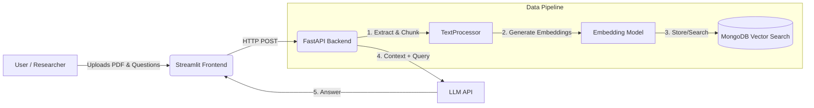

<div align="center">

# 📚 PaperPal V2
### Production-Ready RAG Chatbot for Academic Papers

[](https://www.python.org/downloads/release/python-3100/)
[](https://fastapi.tiangolo.com/)
[](https://streamlit.io/)
[](https://www.docker.com/)
[](https://www.mongodb.com/)
[](https://render.com/)

*An end-to-end AI Application extracting, embedding, and querying knowledge from scientific papers using modern LLMs and Vector Database.*

</div>

---

## 🎯 The Purpose
Reading and extracting insights from dense academic PDFs is time-consuming. **PaperPal** solves this by acting as an intelligent reading assistant. 
Unlike basic scripts, this project is built with **Software Engineering & MLOps best practices**: a decoupled architecture, containerization, and automated cloud deployment.

---

## 🏗️ Architecture Design

PaperPal follows a strict **Microservices Architecture**:
1. **Frontend (Streamlit)**: User interface for uploading PDFs and chatting.
2. **Backend (FastAPI)**: Handles chunking, embedding generation, and LLM API calls.
3. **Database (MongoDB Vector Search)**: Stores dense vectors for fast and scalable semantic retrieval (RAG).



---

## 🚀 Key Features
- **Retrieval-Augmented Generation (RAG)**: Prevents LLM hallucinations by forcing models to answer *only* based on the uploaded document.
- **Microservices Setup**: Fully decoupled UI and API.
- **Dockerized**: 1-click local setup using `docker-compose.yml`.
- **Cloud-Ready**: Configured for automated deployment on Render (`render.yaml`).

---

## 💻 Tech Stack
- **Backend**: Python, FastAPI, Pydantic (Data validation).
- **Frontend**: Streamlit.
- **AI Core**: LangChain / LlamaIndex (or your specific embedding library), OpenAI API / Mistral.
- **Database**: MongoDB Vector Atlas.
- **MLOps/DevOps**: Docker, Docker Compose, Render IaC (Infrastructure as Code).

---

## 🛠️ How to run locally (Docker)

To run this application on your machine, you only need [Docker](https://www.docker.com/) installed. No need to manage Python environments locally.

1. **Clone the repository:**
```bash
git clone https://github.com/zakilbaki/paperpal-2.git
cd paperpal-2
```

2. **Set up environment variables:**
Rename `.env.example` to `.env` and add your API keys (OpenAI, MongoDB URI, etc.).
```bash
cp .env.example .env
```

3. **Build and spin up the containers:**
```bash
docker-compose up --build
```

4. **Access the application:**
- **Frontend UI:** `http://localhost:8501`
- **Backend API Docs (Swagger):** `http://localhost:8000/docs`

---

## 🧠 Challenges & Learnings
- **Chunking Strategy:** Chunking PDFs while preserving academic structure (abstract, methodology, conclusion) required careful overlap tuning to maintain semantic context.
- **Vector Search Optimization:** Transitioning from simple distance metrics to MongoDB Vector Search allowed for scalable retrieval.
- **Containerization for Cloud:** Optimizing the Docker image sizes (`.dockerignore`) to respect the memory limits of free-tier cloud platforms (Render).

---

> **👨‍💻 Author :** Zakaria Ouahabi — *Engineering Student at IMT Télécom Physique Strasbourg*  
> *Actively looking for an AI/ML Engineer CDI starting September 2026. Feel free to connect on [LinkedIn](https://linkedin.com/in/zakaria-ouahabi-2299572a7).*
